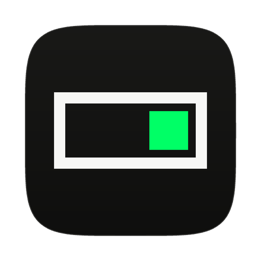

<p align="center">
  
</p>

<h1 align="center">PixelSwitch</h1>

<p align="center">
  Switch Claude Code accounts from the macOS menu bar and keep an eye on each account's usage.<br>
  Made by <a href="https://pixelventures.ai">Pixel Ventures</a>.
</p>

<p align="center">
  <a href="https://github.com/BespokeWoodcraftStudio/PixelSwitch/actions/workflows/build.yml"></a>
  <a href="https://github.com/BespokeWoodcraftStudio/PixelSwitch/releases/latest"></a>
  
  
</p>

PixelSwitch is a small menu bar app for people who use more than one Claude Code account. The built-in `claude auth login` flow is destructive: every switch wipes the previous account's credentials and sends you back through the browser. PixelSwitch keeps a backup of each account, swaps the keychain entry and `~/.claude.json` in one step when you switch, and keeps every account ready for a one-click switch back. It also shows each account's usage limits, today's cost and activity, and refreshes tokens in the background.

PixelSwitch is built on [CCSwitcher](https://github.com/XueshiQiao/CCSwitcher) by Xueshi Qiao. See [Credits](#credits).

## What is different from CCSwitcher

- **Much lighter on memory.** CCSwitcher reads every Claude Code transcript on disk to compute cost and activity. On a heavy-use Mac with about 10,000 transcript files (12 GB), that meant a 3.9 GB spike at launch and about 860 MB of memory from then on. PixelSwitch reads only recent history, the last 24 hours by default. On the same Mac it settles at about 200 MB, and its parse cache shrank from 70.9 MB to 4.9 MB. Change the window in **Settings → General → Usage history window**: 24 hours, 3, 7 or 30 days, or all.
- **Its own updates.** PixelSwitch checks its own release feed on this repository, signed with its own update key. It never picks up a CCSwitcher release by accident.
- **Moves your accounts across.** The first time PixelSwitch starts, it copies your CCSwitcher accounts and settings, so you do not have to sign in again.

## Install

1. Download **PixelSwitch.dmg** from the [latest release](https://github.com/BespokeWoodcraftStudio/PixelSwitch/releases/latest).
2. Open it and drag **PixelSwitch** into **Applications**.
3. The release is not signed with an Apple Developer ID yet, so macOS blocks the first launch. Clear the download flag once in Terminal:

   ```bash
   xattr -dr com.apple.quarantine /Applications/PixelSwitch.app
   ```

   Or try to open it once, then go to **System Settings → Privacy & Security** and click **Open Anyway**.
4. Open PixelSwitch. It lives in the menu bar; there is no Dock icon.

### Moving from CCSwitcher

1. Quit CCSwitcher first. Two account switchers running at once will fight over the same Claude Code login.
2. Open PixelSwitch. Your accounts and settings come across on first launch.
3. macOS asks once whether PixelSwitch may use the saved account credentials (the keychain item `me.xueshi.ccswitcher.backups`, which PixelSwitch keeps under its original name so nothing is lost). Click **Always Allow**.
4. When everything looks right, delete CCSwitcher from Applications.

## Features

- **Non-Interruptive Account Switching**: The native `claude auth logout` clears the current account's credentials, and switching back requires another full OAuth. PixelSwitch keeps a separate backup of each account (keychain token + `~/.claude.json` `oauthAccount` block), atomically swaps both on switch — every added account's credentials stay intact, one-click swap-back, no workflow interruption. Sessions that are already running follow the switch on their next request (see [In-flight sessions](#1-non-interruptive-account-switching)).
- **Multi-Account Management**: Add and switch between different Claude Code accounts with a single click from the macOS menu bar.
- **Usage Dashboard**: Real-time monitoring of your Claude API usage limits (5-hour session and weekly) directly in the menu bar dropdown, plus today's API-equivalent cost and activity stats (turns, active minutes, lines written, model breakdown).
- **Configurable Menu Bar Modules**: Build your own iStats-style menu bar readout. Choose any combination of account name, 5-hour session usage, weekly usage, today's cost, and session/weekly reset countdowns — each rendered as a compact two-line module (label over value, with monochrome progress bars for utilization). Drag to reorder and toggle modules in Settings, with a live preview.
- **Desktop Widgets**: Native macOS desktop widgets in small, medium, and large sizes showing account usage, costs, and activity stats, plus a circular ring variant. Widgets need a build signed with an Apple Developer ID; the public release is not signed yet, so its widgets do not load (see [Install](#install)).
- **In-App Updates**: Powered by [Sparkle 2.x](https://sparkle-project.org/), reading PixelSwitch's own release feed. Every release is signed with the PixelSwitch update key, so the app only accepts updates published here.
- **Dark Mode**: Full light and dark mode support with adaptive colors that follow your system appearance.
- **Internationalization**: Available in English, 简体中文 (Chinese), 日本語 (Japanese), Deutsch (German), and Français (French).
- **Privacy-Focused UI**: Automatically obfuscates email addresses and account names in screenshots or screen recordings to protect your identity.
- **Zero-Interaction Token Refresh**: Intelligently handles Claude's OAuth token expiration by delegating the refresh process to the official CLI in the background.
- **Seamless Login Flow**: Add new accounts without ever opening a terminal. The app silently invokes the CLI and handles the browser OAuth loop for you.
- **System-Native UX**: A clean, native SwiftUI interface that behaves exactly like a first-class macOS menu bar utility, complete with a fully functional settings window.

## Key Features & Architecture

PixelSwitch employs several specific architectural strategies, some uniquely tailored to its operation and others drawing inspiration from the open-source community (notably [CodexBar](https://github.com/steipete/CodexBar)).

### 1. Non-Interruptive Account Switching

The headline feature: **PixelSwitch preserves every added account's credentials, so switching never interrupts your multi-account workflow.**

The native CLI has no clean "switch account" command — `claude auth logout && claude auth login` clears the current account's keychain entry and triggers a full browser OAuth round-trip; switching back to the previous account means another full OAuth. PixelSwitch takes a different path:

- Each previously-added account is stored in PixelSwitch's own per-account backup (`~/.ccswitcher/backups.json`), containing the OAuth token JSON and the matching `oauthAccount` block from `~/.claude.json`.
- When the user picks a different account, PixelSwitch (a) writes the target account's token to the macOS Keychain entry `Claude Code-credentials` through `/usr/bin/security`, the same tool the Claude CLI uses, updating the item in place and reading it back byte for byte before it counts the write as done, and (b) overwrites the `oauthAccount` block in `~/.claude.json`. No destructive logout/login side effects.
- The token reaches `security` on stdin (`security -i`), not on the command line, whenever it fits `security`'s 4,095-byte command line. A credential that also carries MCP server tokens is usually longer than that; it is then passed as hex on the command line, as the Claude CLI does itself. (Writing it through the Security framework instead would move the item out of the partition `/usr/bin/security` can read without a prompt, which breaks the CLI.)
- Result: every added account's credentials stay intact in the backup, available for one-click swap-back without re-OAuth. New `claude` invocations immediately use the newly-selected account.

**In-flight sessions**: a running Claude Code session keeps its token in memory. Before each API request it checks the modification date of its plaintext fallback file, `~/.claude/.credentials.json`: if the file is absent, it re-reads the Keychain (with a 30-second cache); if the file exists and its date has not changed, it keeps the old token for hours, until the access token expires. That file usually does not exist, but a Mac where a Keychain write ever failed can have a stale copy, and on such a Mac running sessions kept billing the old account for 11+ hours after a switch. So after every switch PixelSwitch bumps that file's modification date (it never creates, rewrites or deletes the file), which is the CLI's own signal to re-read the Keychain. Running sessions move to the new account on their next request. If you need an in-flight session to finish on its original account, end it before switching.

### 2. Terminal-Free Login Flow (Native `Process` + `Pipe`)

Unlike tools that build complex pseudoterminals (PTYs) to handle CLI login states, PixelSwitch uses a minimalist approach to add new accounts:

- We rely on native `Process` and standard `Pipe()` redirection.
- When `claude auth login` is executed silently in the background, the Claude CLI detects the non-interactive environment and automatically launches the system's default browser to handle the OAuth loop.
- Once the user authorizes in the browser, the background CLI process terminates with exit code 0. PixelSwitch then captures the newly-generated keychain credentials and `oauthAccount` block — the user never opens a terminal.

### 3. Delegated Token Refresh (A Different Path Than CodexBar)

Claude's OAuth access tokens have a short lifespan (~8 hours) and the refresh endpoint is protected by the Claude CLI's internal client signatures and Cloudflare. Third-party apps that want silent auto-refresh have two paths, and PixelSwitch and [CodexBar](https://github.com/steipete/CodexBar) take **fundamentally different** approaches here:

- **CodexBar's approach**: directly POST to Anthropic's non-public OAuth refresh endpoint (`https://platform.claude.com/v1/oauth/token`) with a hardcoded `client_id` (`9d1c250a-…`, extracted from the Claude CLI binary) plus the `refresh_token` from the keychain, then parse the response and write the new tokens back themselves. Pros: no subprocess, fast. Cons: this endpoint and client_id are **not** officially documented by Anthropic — if they rotate the client_id, change the endpoint, or add client attestation, refresh silently breaks until the next app update ships.
- **PixelSwitch's approach**: listen for `HTTP 401: token_expired` from the Anthropic Usage API; when caught, launch a silent background `claude auth status` — a read-only command — which lets the official Claude CLI use **its own, Anthropic-maintained** refresh logic to fetch a new token and write it back to the keychain. PixelSwitch re-reads the keychain and retries the usage fetch.

We deliberately chose the latter, trading a tiny per-refresh subprocess overhead for two real wins:

1. **Safer**: refresh goes through Anthropic's own CLI auth mechanism. PixelSwitch never holds or replays their internal `client_id`. If Anthropic adds stricter client-side checks (e.g. binary attestation), we automatically inherit them with no app update needed.
2. **Future-proof**: endpoint, client_id, token format — none of it is ours to maintain. CLI upgrades automatically deliver new refresh logic.

The user-visible result is the same as CodexBar's: seamless, zero-interaction. The difference is **who's on the hook for keeping up with Anthropic's private OAuth surface** — CodexBar takes that on themselves (faster, riskier); PixelSwitch delegates to the official CLI (small subprocess cost, safer).

### 4. Local JSONL Parse Cache (Performance)

Cost summaries and today's-activity stats are computed from Claude Code's per-session JSONL files under `~/.claude/projects/`. A heavy user's directory can be hundreds of megabytes across thousands of files. Re-parsing the whole tree every 5 minutes was originally CPU-pegging on idle ([#13](https://github.com/XueshiQiao/CCSwitcher/issues/13)).

- PixelSwitch maintains a persistent per-file parse cache at `~/Library/Application Support/PixelSwitch/session-parse-cache.json`, keyed by file mtime.
- On each refresh, files with unchanged mtime are skipped entirely — the cache holds their previously-parsed aggregates and the result is summed in memory.
- Only the actively-modified files (typically just your current Claude Code session) get re-parsed. Steady-state refreshes drop from ~5 seconds of saturated CPU to under 100ms.

### 5. Security-CLI Keychain Reader

Reading from the macOS Keychain via native `Security.framework` (`SecItemCopyMatching`) from a background menu bar app sometimes surfaces a blocking system UI prompt — "PixelSwitch wants to access your keychain". To bypass this, PixelSwitch adopts CodexBar's strategy:

- We execute the system-bundled tool `/usr/bin/security find-generic-password -s "Claude Code-credentials" -w`.
- When macOS prompts the user *the first time*, the user clicks **"Always Allow"**. Because the request comes from a system binary rather than our signed app, the grant persists permanently.
- Subsequent background polling is completely silent.

**About PixelSwitch's own backup keychain entries**: the per-account backup store (`me.xueshi.ccswitcher.backups`) is a keychain entry PixelSwitch creates and owns, so there's no cross-vendor prompt to dodge. We read/write it via the native `Security.framework` (`SecItemCopyMatching` / `SecItemAdd`) — no subprocess, no prompt. In short: **the `/usr/bin/security` subprocess approach is reserved specifically for the cross-vendor read of Claude Code's keychain entry; everything else uses the most direct native API.**

### 6. Team-ID-Prefixed App Group (No "Access Data From Other Apps" Prompt)

macOS 15 Sequoia silently changed the rules for App Group containers: any non-Mac-App-Store, non-TestFlight app whose App Group ID does NOT begin with the developer Team ID triggers a TCC "App Management" prompt on every launch (and again after every auto-update that changes the binary's cdhash). PixelSwitch's App Group is declared as `$(TeamIdentifierPrefix)ai.pixelventures.pixelswitch`, the Team-ID-prefixed form, which macOS auto-authorizes for Developer-ID-signed apps without a provisioning profile. The app reads the group ID from its own signed entitlements at runtime, so it always matches whichever team signed the build. An unsigned or ad-hoc build has no entitlements and never touches a group container at all, which is why it never shows the prompt (and why its widgets stay empty). Background: CCSwitcher [#14](https://github.com/XueshiQiao/CCSwitcher/issues/14).

### 7. SwiftUI `Settings` Window Lifecycle Keepalive for `LSUIElement`

Because PixelSwitch is a pure menu bar app (`LSUIElement = true`), SwiftUI refuses to present the native `Settings { … }` window — a known macOS quirk where SwiftUI assumes the app has no active scene to attach Settings to. PixelSwitch implements CodexBar's **lifecycle keepalive** workaround:

- On launch, the app creates a `WindowGroup("PixelSwitchKeepalive") { HiddenWindowView() }`.
- `HiddenWindowView` intercepts its underlying `NSWindow` and makes it a 1×1 pixel, completely transparent, click-through window positioned off-screen at `(-5000, -5000)`.
- Because this "ghost window" exists, SwiftUI is convinced the app has an active scene. When the user clicks the gear icon, we post a `Notification` that the ghost window catches to trigger `@Environment(\.openSettings)`, producing a perfectly functioning native Settings window.

## Build from source

The project is generated with [XcodeGen](https://github.com/yonaskolb/XcodeGen); `project.yml` is the only source of truth.

```bash
brew install xcodegen
xcodegen generate
open PixelSwitch.xcodeproj
```

To sign locally, set your own Apple team as `DEVELOPMENT_TEAM` in `project.yml` (both targets). Without Xcode, push to `main` and the [build workflow](.github/workflows/build.yml) produces a universal DMG as a build artifact; pushing a `v*` tag publishes a release with the DMG and the Sparkle `appcast.xml`. The app icon is drawn by `Tools/icon/make_icon.py`.

## Credits

PixelSwitch is a fork of [CCSwitcher](https://github.com/XueshiQiao/CCSwitcher) by [Xueshi Qiao](https://github.com/XueshiQiao), and almost all of its account switching, usage tracking and interface is his work. Thank you. Several ideas in both apps come from [CodexBar](https://github.com/steipete/CodexBar).

The original CCSwitcher repository does not publish a license. PixelSwitch is shared here as a GitHub fork, with credit to its author, and it will follow whatever license the original adopts.

PixelSwitch changes, the app icon and the Pixel Ventures name and mark are © 2026 Pixel Ventures.
